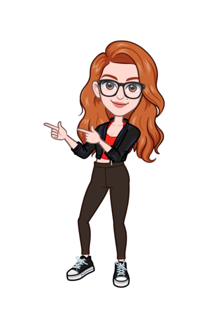

# Karolline Uchôa 👋

Me chamo Karolline, mas pode me chamar de Karol. Tenho 37 anos, sou natural de Belém/PA, e atualmente moro no Rio de Janeiro/RJ. Sou apaixonada por gatinhos e animais em geral 🐈.

Atualmente, sou Estagiária na área de Rentabilization Management da TIM Brasil, onde fui aprovada entre 148 estagiários em um processo seletivo com quase 16 mil candidatos. Minhas atividades incluem suporte em análises de bases de dados, criação de dashboards e apresentações com Power BI e PowerPoint, além da validação de dados para gerar insights estratégicos.

Estou cursando Ciência da Computação 💻 desde agosto de 2023 e me aprofundei no mundo da análise de dados a partir de maio do mesmo ano. Desde então, essa área se tornou uma verdadeira paixão 📊.

Nas horas vagas, gosto de assistir a séries e filmes 📺 para relaxar e de jogar videogames 🎮 para desafiar minha mente e me divertir.

Sinta-se à vontade para entrar em contato para conversar sobre projetos ou para trocar ideias 💡.

## 👩🏻‍🦰 Mais sobre Mim

- 🎓 Cursando Ciência da Computação na Estácio;
- 📊 Estagiária em Análise de Dados na TIM Brasil, na área de Rentabilization Management;
- 📚 Minhas áreas de estudo incluem Análise de Dados, Aprendizado de Máquina, Visualização de Dados e muito mais;
- 💼 Estou sempre em busca de oportunidades de aprendizado e projetos desafiadores;
- 🌍 Sou apaixonada por explorar novos conceitos e compartilhar meu conhecimento com a comunidade;
- 😺 Mordi minha língua e hoje sou apaixonada por gatos.

## 🔎 O Que Você Encontrará Aqui

- 📁 Projetos relacionados à Ciência de Dados e programação. 
- 📝 Repositórios de estudos, incluindo notebooks Jupyter e código de projetos pessoais. 
- 🧠 Documentação e recursos que encontrei úteis durante minha jornada de aprendizado. 

### 🛠️**Ferramentas e Tecnologias**

- Python;
- Git;
- SQL.
   

   
   
   

### 🌱 **Estou aprendendo**

- Excel;
- Power BI.
   
  
   

## 💬 Conecte-se Comigo

- 📫 Você pode entrar em contato comigo pelo meu [e-mail]("mailto:karolline.uchoa@gmail.com").
- 💼 Meu perfil no [LinkedIn](https://www.linkedin.com/in/karolline-uchoa) para acompanhar meu progresso e projetos.
- 📷 Meu perfil no [Instagram](https://www.instagram.com/karollineuchoa/) para conhecer mais da minha vida pessoal.

##

<a href="https://github.com/karollineuchoa">

## 🤝🏻 Agradecimento

Agradeço por visitar meu perfil do GitHub e espero que encontre projetos e recursos interessantes por aqui. Se você compartilha dos mesmos interesses ou está buscando colaborar em projetos, não hesite em entrar em contato. Vamos aprender e crescer juntos!

Obrigada mais uma vez e até logo!👋🏻

Karol 👩🏻‍🦰
